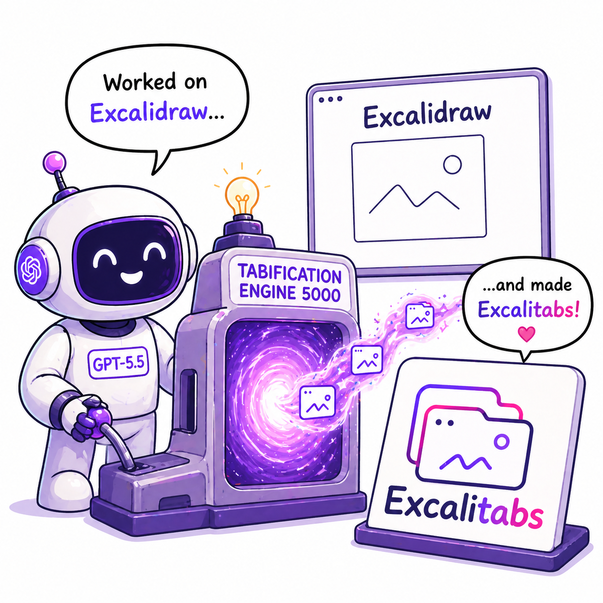

<div align="center">
  

  <p><strong>Multiple drawings. One Excalidraw session.</strong></p>

  <p>
    <a href="https://1ucas.github.io/excalitabs/"><strong>Try the live demo</strong></a>
    ·
    <a href="https://github.com/excalidraw/excalidraw">Upstream Excalidraw</a>
    ·
    <a href="https://github.com/excalidraw/excalidraw/compare/master...1ucas:excalitabs:master">Review the clean patch</a>
  </p>
</div>

<br />

<div align="center">
  <a href="https://1ucas.github.io/excalitabs/">
    
  </a>
</div>

## What is ExcaliTabs?

ExcaliTabs is an experimental fork that adds a multi-drawing workspace to the Excalidraw app. Each drawing keeps its own elements and scene state, while a compact tab strip makes switching feel as immediate as moving between documents in a browser.

The feature is intentionally app-scoped: the reusable `@excalidraw/excalidraw` package and upstream product surfaces remain intact.

## Try the workflow

1. Create a second drawing with the **+** button in the footer.
2. Draw something different in each tab, then switch between them.
3. Click the active tab to rename it.
4. Open an `.excalidraw` file: it becomes a drawing instead of replacing the current one.
5. Reload the page and continue where you left off.

On phones, the same drawings are available from **Main menu → Drawings**.

## Implementation tour

| Area | Behavior |
| --- | --- |
| Local drawing model | Stores elements, scene state, names, timestamps, and the active drawing in browser storage. |
| Scene switching | Snapshots the current scene before restoring the selected drawing and clearing cross-document history. |
| Import flows | Opens incoming drawings as tabs, reusing an empty active drawing when appropriate. |
| Desktop UI | Scrollable tabs with create, rename, and guarded deletion controls. |
| Mobile UI | A dedicated drawings submenu with selection, creation, and deletion. |
| Collaboration safety | Prevents switching drawings during a live collaboration session. |

The contribution-ready implementation lives on [`master`](https://github.com/1ucas/excalitabs/tree/master). This branch adds only the showcase branding, assets, copy, and GitHub Pages workflow on top.

## Validation

The clean Tabs patch is verified with:

- TypeScript type checking, ESLint, and Prettier
- 1,599 passing tests across 111 test files
- a production Vite build
- desktop and phone browser checks
- real scene-isolation checks across drawing creation, switching, rename, deletion, and reload persistence

## Project story

This experiment started with a straightforward product question: could Codex help implement the kind of multi-drawing workflow people know from tools such as draw.io, directly inside a large open-source codebase?

The result covers the feature end to end—from the local drawing model and import behavior to responsive UI, tests, browser validation, and a clean upstream-ready commit.

The supplied English and Portuguese social copy is kept in [`showcase/linkedin-post.txt`](./showcase/linkedin-post.txt).

## Local development

This fork keeps the original Excalidraw monorepo workflow:

```bash
corepack yarn install --frozen-lockfile
corepack yarn start
```

Then open the local URL printed by Vite.

## Upstream and license

ExcaliTabs is not an official Excalidraw distribution. For the official editor, package, documentation, and contribution process, visit:

- [Excalidraw](https://excalidraw.com)
- [Excalidraw repository](https://github.com/excalidraw/excalidraw)
- [Excalidraw documentation](https://docs.excalidraw.com)

This fork preserves Excalidraw's [MIT license](./LICENSE).
