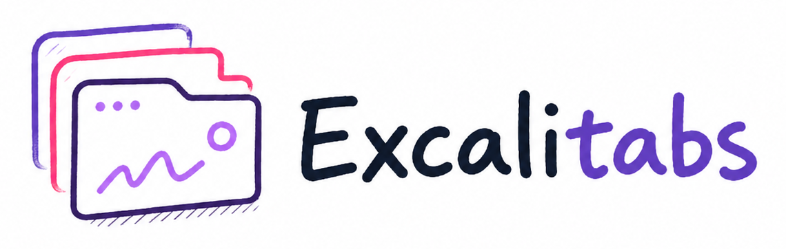
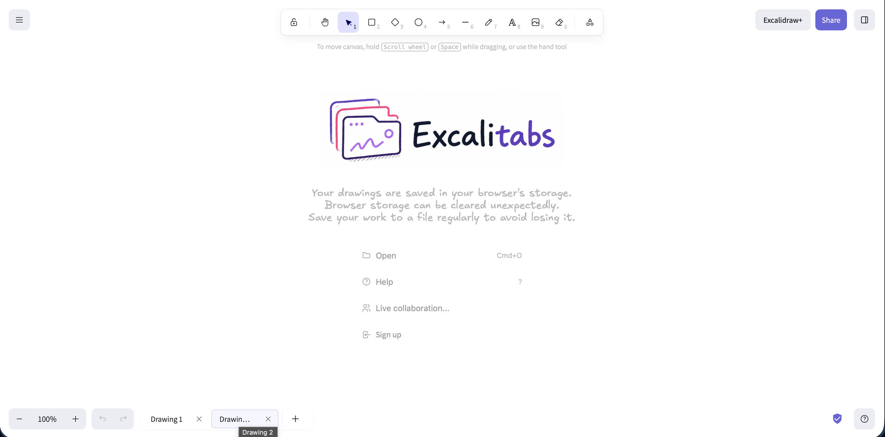

<div align="center">
  

  <h1>Excalitabs</h1>

  <p>
    <strong>An AI-assisted Proof-of-Concept fork of Excalidraw with multi-drawing tabs.</strong>
  </p>

  <p>
    <a href="https://github.com/1ucas/excalidraw/tree/feat/excalitabs">
      
    </a>
    <a href="https://github.com/1ucas">
      
    </a>
    
    
  </p>
</div>

---

## 🚧 Proof-of-Concept Notice

> **Excalitabs is not intended to be a fully featured, polished, or maintainable product.**
>
> Treat this repository as an implementation experiment by GitHub user [@1ucas](https://github.com/1ucas), not as an official Excalidraw distribution or a production-ready alternative.

This fork exists to demonstrate how AI can be used directly inside an existing open-source codebase to implement meaningful product features. In this case, the experiment adds a tab system so users can keep multiple drawings open and switch between them, closer to the workflow in tools like draw.io.

## 🖼️ Visual Preview

<div align="center">
  
</div>

## ✨ What This Experiment Shows

| Area | What was explored |
| --- | --- |
| 🗂️ Drawing tabs | Keep multiple drawings available in the same app session. |
| 💾 Local persistence | Store drawing state locally so switching tabs does not immediately lose work. |
| 🔄 Active switching | Move between drawings while preserving the active document context. |
| 📥 Import behavior | Adapt import/share flows so incoming files create new drawings instead of overwriting current work. |
| 🧭 Bottom tab UI | Add a visible tab switcher to the existing Excalidraw interface. |
| 🧪 Validation | Run formatting, type checking, linting, and focused tests as part of the workflow. |

## 🤖 Why Excalitabs Exists

The original motivation was simple:

> Can Codex help implement a real feature in a large open-source codebase starting from one prompt?

The result is this fork: **ExcaliTabs**, a small but concrete demonstration of AI-assisted feature development inside the open-source [Excalidraw](https://github.com/excalidraw/excalidraw) repository.

## 🏛️ Upstream Excalidraw

Excalitabs is based on Excalidraw. For the official project, documentation, npm package, issues, and production product information, use the upstream links:

- 🖊️ [Excalidraw app](https://excalidraw.com)
- 📚 [Excalidraw documentation](https://docs.excalidraw.com)
- 🧑‍💻 [Excalidraw repository](https://github.com/excalidraw/excalidraw)

## 🧑‍💻 Local Development

This fork keeps the original monorepo structure. To run it locally, use the upstream development workflow:

```bash
yarn
yarn start
```

Then open the local URL printed by Vite.

## 📄 License

This fork preserves the upstream Excalidraw license. See [LICENSE](./LICENSE).
